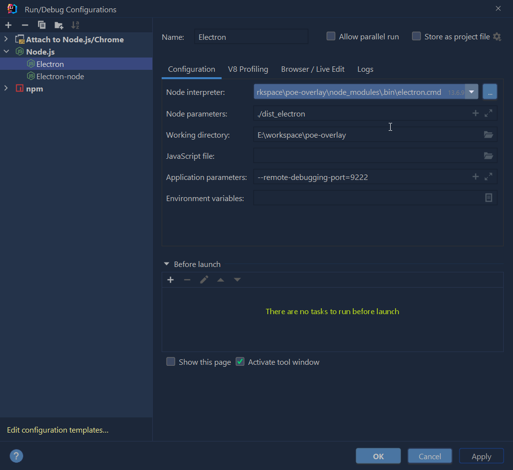

# poe-overlay

## Project setup

```
npm install
```

### Compiles and hot-reloads for development

```
npm run serve
```

### Compiles and minifies for production

```
npm run build
```

### Lints and fixes files

```
npm run lint
```

### Icon list

https://pictogrammers.github.io/@mdi/font/2.0.46/

### Customize configuration

See [Configuration Reference](https://cli.vuejs.org/config/).

### How to debug

Run both debug config.




In vue.config.js

```javascript
  configureWebpack: {
  devtool: "source-map",
},
```

In tsconfig.son

```json
    "inlineSources": true,
    "sourceMap": true,
```


